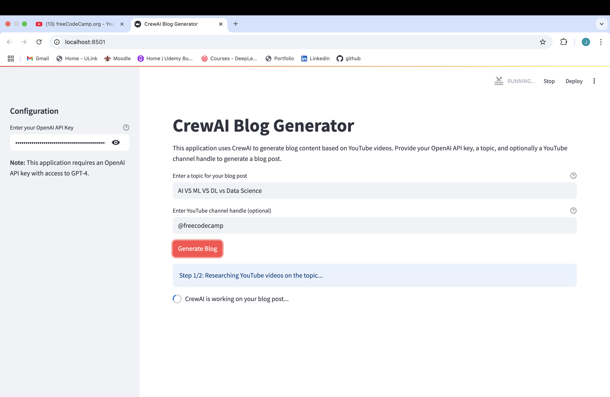

<center><h1>🚀 CrewAI Blog Generator Agent 🚀</h1></center>

Turn YouTube videos into awesome blog posts automatically! ✨ This app uses CrewAI agents to find YouTube videos on your topic (from a specific channel or default), grab the content, and write a blog post using AI via a simple Streamlit interface.



## Features 🌟

-   **Automated Blogging:** ✍️ Creates blog posts from YouTube video transcripts.
-   **Topic Research:** 🔍 Finds relevant YouTube videos for your topic.
-   **Channel Specific:** 🎯 Target a specific YouTube channel (defaults to `@freecodecamp`).
-   **Easy Interface:** 🖥️ Simple Streamlit web app for input and results.
-   **Download:** 💾 Get your blog post as a Markdown file.

## Project Files 📁

-   `app.py`: Main Streamlit app.
-   `crew.py`: CrewAI setup (agents, tasks).
-   `agents.py`: Researcher & Writer agents.
-   `tasks.py`: Research & Writing tasks.
-   `tools.py`: Agent tools (like YouTube search).

## Get Started 🛠️

1.  **Clone:**
    ```bash
    git clone https://github.com/pjmreddy/CrewAI-Blog-Generator-Agent.git
    cd CrewAI-Blog-Generator-Agent
    ```

2.  **Install:**
    ```bash
    pip install -r requirements.txt
    ```

3.  **OpenAI API Key:**
    -   You need a GPT-4 capable OpenAI key (model in `agents.py`).
    -   Enter it in the app's sidebar (it's not stored).

## How to Use 📝

1.  **Run:**
    ```bash
    streamlit run app.py
    ```

2.  **Open:** Go to the local URL (usually `http://localhost:8501`).

3.  **API Key:** Enter your OpenAI key in the sidebar.

4.  **Topic:** Input your blog post topic.

5.  **(Optional) Channel:** Add a YouTube handle (e.g., `@mkbhd`) or use the default (`@freecodecamp`).

6.  **Generate:** Click the "Generate Blog" button.

7.  **Wait:** Let the agents work their magic! 🪄

8.  **View:** See the generated blog post on the page.

## How it Works ⚙️

Two CrewAI agents team up:

1.  **Blog Researcher:** 🕵️ Finds YouTube videos for the topic and gets the info/transcripts.
2.  **Blog Writer:** ✍️ Uses the research to write a great blog post.
